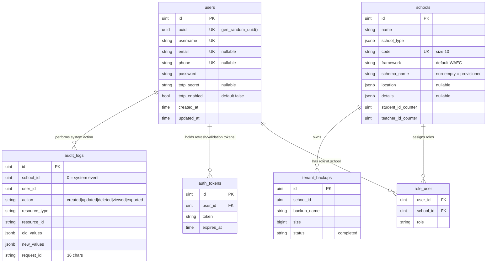

# Academio FSD — Part 4: Data & API Design

> **Part of**: Functional Specification Document (FSD)
> **Status**: Ratified baseline for implementation
> **Audience**: Backend, Frontend, Platform Engineering
> **Source of truth**: `backend/internal/database/migrations/`, `backend/internal/modules/`, `backend/internal/router/`, `backend/pkg/`

---

## 1. Database Design

### 1.1 Topology

Academio runs on a **single PostgreSQL instance** with **schema-per-tenant** isolation.

```
┌──────────────────────────────────────────────────────────────┐
│  PostgreSQL — database `academio` (shared-postgres:5432)     │
│                                                              │
│  public schema (shared)          school_1..N schemas (tenant)│
│  ┌─────────────────────┐         ┌────────────────────────┐  │
│  │ users               │  FK ──► │ user_infos             │  │
│  │ schools             │◄── FK ─ │ teachers, students     │  │
│  │ role_user (join)    │         │ levels, subjects       │  │
│  │ audit_logs (sys)    │         │ sessions, curricula    │  │
│  │ tenant_backups      │         │ assessments, scores    │  │
│  │ auth_tokens         │         │ results, timetables    │  │
│  └─────────────────────┘         │ bills, payments        │  │
│                                  │ audit_logs (per-school)│  │
│                                  └────────────────────────┘  │
└──────────────────────────────────────────────────────────────┘
```

**Rules enforced by the platform:**

| Rule | Detail |
|---|---|
| Identity lives in `public` | `users`, `schools`, role assignments, system audit log |
| All school data lives in `school_{id}` | Every tenant-scoped table is prefixed by the GORM `SchemaTablePrefix` plugin |
| Cross-schema FKs | `school_{id}.students.user_id → public.users.id` |
| Single connection pool | No per-school connections; schema resolved via `TenantResolutionService` (Redis-cached) |
| Provisioning | Synchronous; a school is provisioned when `schools.schema_name` is non-empty |

### 1.2 Shared Schema (`public`)

| Table | Purpose | Key columns |
|---|---|---|
| `users` | Global identity | `username` (unique), `email` (unique, nullable), `phone` (unique, nullable), `password`, `totp_secret`, `totp_enabled` |
| `schools` | Tenant registry | `name`, `school_type` (jsonb), `code` (unique, 10), `framework` (default `WAEC`), `schema_name`, `location` (jsonb), `details` (jsonb) |
| `role_user` | Many-to-many `users ↔ schools/roles` | `user_id`, `school_id`, `role` |
| `audit_logs` | System-wide audit (school_id = 0) | `action`, `resource_type`, `resource_id`, `old_values`/`new_values` (jsonb), `imp_school_id`, `request_id` |
| `auth_tokens` | Refresh-token & validation-token storage | `user_id`, `token`, `expires_at` |
| `tenant_backups` | Backup/restore registry | `school_id`, `backup_name`, `size`, `status` (`completed`) |
| `totp_settings`, `education_framework`, `school_framework` | MFA + regulatory data | Defined in `migrations/core/` |

### 1.3 Tenant Schema (`school_{id}`)

Every provisioned school receives its own schema. Core tables:

| Table | Purpose | Notes |
|---|---|---|
| `user_infos` | Tenant-side profile extension of `public.users` | Joined via `users.id` |
| `teachers`, `students`, `student_parents` | People records | Reference `public.users` |
| `levels`, `subjects` | School structure | Level carries school-type (nursery/primary/jss/sss/maternelle…) |
| `sessions`, `session_curriculum` | Academic sessions + curriculum binding | Session `status` defaults `not-active`; `approval_status` flow: `pending → subject_submitted → class_reviewed → principal_approved` |
| `curricula`, `assessments`, `grade_items`, `scores` | Assessment hierarchy | See 1.5 |
| `results`, `archived_scores`, `external_exam_results`, `academic_period_types` | Result processing | `archived_scores.period_type_id` and `external_exam_results.period_type_id` FK → `academic_period_types.id` (`ON DELETE SET NULL`) |
| `timetables` | Scheduling | |
| `bills`, `payments` | Billing | |
| `audit_logs` | Per-school audit trail | Mirrors the public table |

**Migration strategy** (`backend/internal/database/migrations/school/school.go`):
- `AutoMigrate` in consolidated groups (1–8) for stable model changes
- Raw SQL for column/constraint evolution (e.g. `period_type_id` backfill on `archived_scores` and `external_exam_results`)
- Each migration runs inside the tenant schema via `SET LOCAL search_path`

### 1.4 Base Model Conventions

Every entity embeds `BaseModel`:

```go
type BaseModel struct {
    ID        uint      `gorm:"primarykey"`
    UUID      uuid.UUID `gorm:"type:uuid;uniqueIndex;default:gen_random_uuid()"`
    CreatedAt time.Time
    UpdatedAt time.Time
    DeletedAt gorm.DeletedAt `gorm:"index"`
    CreatedBy *uuid.UUID
    UpdatedBy *uuid.UUID
}
```

> **⚠ Implementation constraint**: `CreatedAt`/`UpdatedAt` intentionally omit GORM's `autoCreateTime`/`autoUpdateTime`. With `PrepareStmt: true`, the `SchemaTablePrefix` plugin invalidates GORM's cached field-index mapping and `ConvertToCreateValues` writes `time.Time` into wrong-typed fields. **Callers must set timestamps explicitly** (services do this via a shared create helper).

`BaseModelSoftDelete` exposes `deleted_at` in JSON responses when soft-delete state must be visible.

### 1.5 Assessment Domain (tenant)

```
Curriculum 1─N Assessment 1─N GradeItem
                   │
                   └─N Score   (one row per assessment+session+level+subject+student)
```

| Entity | Key fields | Semantics |
|---|---|---|
| `Curriculum` | `school_type` (default `nursery_primary`), `active_continuous_assessment_id *uint` | ⚠ FK has no `ON DELETE SET NULL` — callers must clear before deleting the referenced CBA |
| `Assessment` | `is_ca`, `is_exam`, `total` (float32), `total_basis_points` (default 10000), `recalc_needed`, `cba_assignment_id *uint` | Continuous Assessment vs Exam flag |
| `GradeItem` | `max_score` (default 100), `sort_order` | `MaxScoreBP() = round(MaxScore * 100)` |
| `Score` | `score` JSON blob | Single row per (assessment, session, level, subject, student) |

### 1.6 Audit & Retention

- **Mutations always audit**: every create/update/delete records `school_id`, `user_id`, `action`, `resource_type`, `resource_id`, `request_id` (36-char UUID) plus JSON old/new values.
- **Two sinks**: system events (`school_id == 0`) → `public.audit_logs`; per-school events → `school_{id}.audit_logs`.
- **Retention**: `AuditLogArchive` copies satisfy data-retention policy; archived rows are removable for GDPR-style erasure.

---

## 2. ER Diagrams

### 2.1 Shared Schema (`public`)



### 2.2 Tenant Schema (`school_{id}`) — Academic Core

```mermaid
erDiagram
    users ||--o| user_infos : "extends (tenant copy)"
    users ||--o{ teachers : "is"
    users ||--o{ students : "is"
    levels ||--o{ students : "enrolled in"
    levels ||--o{ subjects : "offers"
    sessions ||--o{ session_curriculum : "binds"
    curricula ||--o{ session_curriculum : "bound to"
    curricula ||--o{ assessments : "contains"
    assessments ||--o{ grade_items : "composed of"
    assessments ||--o{ scores : "measured by"
    students ||--o{ scores : "receives"
    subjects ||--o{ scores : "scored for"
    levels ||--o{ scores : "scored in"
    sessions ||--o{ scores : "scored during"
    academic_period_types ||--o{ archived_scores : "classifies"
    academic_period_types ||--o{ external_exam_results : "classifies"

    user_infos {
        uint user_id FK "→ public.users.id"
        jsonb data
    }
    teachers {
        uint id PK
        uint user_id FK "→ public.users.id"
        uint level_id FK "nullable"
    }
    students {
        uint id PK
        uint user_id FK "→ public.users.id"
        uint level_id FK
        string admission_no
    }
    levels {
        uint id PK
        string name
        string school_type "nursery|primary|jss|sss|maternelle|..."
        uint sort_order
    }
    subjects {
        uint id PK
        uint level_id FK
        string name
    }
    sessions {
        uint id PK
        string name
        string year
        string term
        string status "default not-active"
        string approval_status "pending → subject_submitted → class_reviewed → principal_approved"
    }
    session_curriculum {
        uint session_id FK
        uint curriculum_id FK
    }
    curricula {
        uint id PK
        string school_type "default nursery_primary"
        uint active_continuous_assessment_id "⚠ no ON DELETE SET NULL"
    }
    assessments {
        uint id PK
        uint curriculum_id FK
        string name
        bool is_ca
        bool is_exam
        float total
        int total_basis_points "default 10000"
    }
    grade_items {
        uint id PK
        uint assessment_id FK
        string name
        float max_score "default 100"
        uint sort_order
    }
    scores {
        uint id PK
        uint assessment_id FK
        uint session_id FK
        uint level_id FK
        uint subject_id FK
        uint student_id FK
        jsonb score "default {}"
    }
    archived_scores {
        uint id PK
        uint period_type_id FK "ON DELETE SET NULL"
        jsonb data
    }
    external_exam_results {
        uint id PK
        uint period_type_id FK "ON DELETE SET NULL"
        jsonb data
    }
    academic_period_types {
        uint id PK
        string name
        string code
    }
```



---

## 3. API Design

### 3.1 Conventions

| Convention | Specification |
|---|---|
| Base URL | `/api/v2` (frontend: `import.meta.env.VITE_API_URL || "/api/v2"`) |
| Versioning | URL path (`/api/v2/...`); `/api/v1` retained for backup/restore |
| Transport | JSON over HTTPS; `Content-Type: application/json` |
| Auth | JWT (see §4) — `Authorization: Bearer <access_token>` **or** httpOnly cookies |
| Rate limiting | 100 requests/min per client (Redis-backed in dev/prod, in-memory fallback) |
| Idempotency | `Idempotency-Key` header on state-changing requests |
| Pagination | Page-based, `Offset`+`Limit`; default `page=1&limit=20`, limit clamped to 1–100 |
| Documentation | Swagger UI `/swagger/index.html` (dev), OpenAPI JSON `/swagger/doc.json` |

### 3.2 Response Envelope

Every endpoint returns the same envelope:

```json
{
  "success": true,
  "data": { },
  "error": null,
  "meta": {
    "request_id": "9f1c2b4d-…-…-…-…",
    "timestamp": "2026-07-31T12:00:00Z",
    "operation": "list_scores",
    "pagination": {
      "page": 1,
      "limit": 20,
      "total": 143,
      "total_pages": 8,
      "has_next": true,
      "has_prev": false
    }
  }
}
```

**Error envelope** (HTTP 4xx/5xx):

```json
{
  "success": false,
  "data": null,
  "error": {
    "code": "RESULT_NOT_FOUND",
    "message": "result with id 42 not found",
    "category": "BUS",
    "details": null,
    "request_id": "9f1c2b4d-…",
    "documentation": "https://docs.academio.app/errors/RESULT_NOT_FOUND"
  }
}
```

**Error categories** (`backend/pkg/response`):

| Category | Meaning | Example codes |
|---|---|---|
| `AUTH` | Authentication failures | `AUTH_FAILED`, `TOKEN_EXPIRED`, `TOKEN_INVALID` |
| `AUTHZ` | Authorization failures | `FORBIDDEN`, `ROLE_REQUIRED` |
| `VALID` | Request validation | `VALIDATION_FAILED`, `BAD_REQUEST` |
| `BUS` | Domain/business rule violation | `RESULT_NOT_FOUND`, `DUPLICATE_STUDENT` |
| `SYS` | Server/internal failure | `INTERNAL`, `PDF_ERROR` |
| `EXT` | External dependency failure | `EMAIL_PROVIDER_DOWN` |

### 3.3 Pagination

All list endpoints use `helpers.ParsePagination(c)`:

```go
page, limit := helpers.ParsePagination(c) // page=1, limit=20 (clamped ≤ 100)
items, total, err := service.List(ctx, page, limit)
response.SuccessWithPagination(c, items, page, limit, total)
```

```http
GET /api/v2/scores?page=3&limit=50
```

### 3.4 Endpoint Catalog (v2)

All groups below are mounted through the `authGroup` helper → **JWT auth → tenant resolution → audit middleware** chain.

| Module | Base path | Representative endpoints |
|---|---|---|
| auth | `/auth` | `POST /login`, `POST /refresh`, `POST /logout`, `POST /totp/*`, `GET /csrf-nonce` |
| user | `/user`, `/users` | Profile, `users` (paginated), `users/{id}` |
| school | `/schools` | CRUD + provisioning; `GET /schools/{id}` shows `schema_name` when provisioned |
| invite | `/invite` | Send/accept invitations |
| academic | `/academic` | Levels, subjects, sessions, curricula, assessments, attendance |
| grading | `/grading` | Grade boundaries |
| score | `/scores` | Record/list scores (nested under `/academic` and standalone) |
| result | `/results` | Result computation, approval workflow |
| timetable | `/timetables` | Scheduling |
| exam | `/exams` | Exam schedules, results |
| external-exam | `/external-exam` | WASSCE/NECO-style results |
| bill | `/bills` | Invoice generation |
| payment | `/payments` | Payment processing |
| dashboard | `/dashboard` | Aggregated KPIs |
| analytics | `/analytics` | Reports + AI forecasting |
| cba | `/cba` | Computer-based assessment engine |
| career | `/career` | Guidance, job board |
| lms | `/lms` | Learning management |
| library | `/library` | Books, issues |
| media | `/media` | Media library |
| hostels | `/hostels` | Rooms, beds |
| transport | `/transport` | Routes, vehicles |
| inventory | `/inventory` | Assets, maintenance |
| alumni | `/alumni` | Directory, events, donations, mentorship |
| pastoral | `/pastoral` | Wellness surveys, counseling |
| finance | `/finance` | Chart of accounts, journals, budgets, expenses, fee structures |
| hr | `/hr` | Departments, staff, leave, payroll, appraisal, recruitment |
| reports | `/reports`, `/reports/configs` | Ad-hoc report generation |
| report-cards | `/report-cards` | Digital report cards (PDF via Gotenberg) |
| messages | `/messages` | 1:1 messaging |
| notifications | `/notifications` | In-app + FCM push, device tokens |
| communication | `/communication` | Email/SMS/WhatsApp templates, campaigns, broadcasts |
| discipline | `/discipline` | Incidents, detentions, suspensions, conduct records |
| conferences | `/conferences` | Parent-teacher conference slots/bookings |
| student-health | `/student-health` | Health records |
| admissions | `/admissions` | Applications, offers, AI scoring |
| audit-logs | `/audit-logs` | Query audit trail |
| parent | `/parent` | Parent dashboard |
| student | `/student` | Student portal |
| forum | `/forum` | Discussion forums |
| lesson-plans | `/lesson-plans` | Schemes of work, lesson plans/notes, approvals |
| ai | `/ai` | Agent chat, NL search |
| academic-calendar | `/academic-calendar` | Calendar events/terms |
| external-exam | `/external-exam` | External exam results |

**Infrastructure endpoints:**

| Path | Purpose |
|---|---|
| `GET /health`, `/livez`, `/readyz` | Liveness/readiness (DB, Redis, queue, AI) |
| `GET /metrics` | Prometheus metrics |
| `GET/POST /api/v1/backups/{schoolId}/...` | Backup list / restore / status |
| `POST /api/v2/pdf/render` | Dev-only HTML→PDF (disabled in production) |

### 3.5 Example — Score Creation

```http
POST /api/v2/scores
Authorization: Bearer eyJhbGciOi…
Idempotency-Key: 7f9c1b2e-…

{
  "assessment_id": 12,
  "session_id": 3,
  "level_id": 5,
  "subject_id": 8,
  "student_id": 42,
  "score": { "ca": 28.5, "exam": 61.0 }
}
```

```json
{
  "success": true,
  "data": { "id": 2107, "assessment_id": 12, "score": { "ca": 28.5, "exam": 61.0 } },
  "error": null,
  "meta": { "request_id": "9f1c2b4d-…", "timestamp": "2026-07-31T12:00:00Z", "operation": "create_score" }
}
```

---

## 4. Authentication

### 4.1 Token Model

| Token | Lifetime | Storage | Purpose |
|---|---|---|---|
| Access (JWT) | 15 min | Client (cookie or memory/Bearer) | Stateless auth on every request |
| Refresh | 7 days | Redis `refresh:{id}` + rotated on use | Issue new token pair |

JWT claims (`backend/pkg/jwt`):

```go
type Claims struct {
    UserID        uint   `json:"user_id"`
    UserUUID      string `json:"user_uuid"`
    Email         string `json:"email"`
    Role          string `json:"role"`
    SchoolID      uint   `json:"school_id"`
    SchoolUUID    string `json:"school_uuid"`
    TokenType     string `json:"token_type"`     // access | refresh
    FamilyID      string `json:"family_id"`      // refresh-rotation family
    ImpersonatorID uint  `json:"impersonator_id"`
    jwt.RegisteredClaims
}
```

### 4.2 Two Transport Modes

**Mode A — Cookies (browser SPA, primary):**

| Cookie | HttpOnly | Purpose |
|---|---|---|
| `_g_access_token` | ✅ | JWT access token |
| `_g_refresh_token` | ✅ | Opaque refresh token (rotated) |
| `_g_access_expiry` | ❌ | Access-expiry epoch (ms) — lets JS schedule refresh |

- `SameSite=None` when `APP_ENV=production`, else `Lax`
- Overridable via `ACCESS_TOKEN_COOKIE`, `REFRESH_TOKEN_COOKIE`, `ACCESS_EXPIRY_COOKIE`, `COOKIE_DOMAIN`
- Refresh max-age: 7 days

**Mode B — Bearer (mobile/native/API clients):**

```http
Authorization: Bearer <access_token>
```

- Refresh token held by client; on `401 TOKEN_EXPIRED` → `POST /auth/refresh` → retry once
- Frontend keeps a singleton refresh guard to prevent concurrent refreshes; cross-tab sync via `localStorage` event channel (`academio-auth`)

### 4.3 Auth Endpoints

| Endpoint | Behavior |
|---|---|
| `POST /auth/login` | Verify credentials (bcrypt), issue access + refresh pair, rotate into Redis, set cookies |
| `POST /auth/refresh` | Verify refresh token in Redis → rotate (old invalidated) → return new pair |
| `POST /auth/logout` | Revoke refresh token, blacklist access token |
| `POST /auth/totp/*` | Enroll / verify / disable TOTP MFA (`totp_settings`) |
| `GET /auth/csrf-nonce` | CSRF token for cookie-mode state changes |

### 4.4 Authentication Flow (Cookie Mode)

```mermaid
sequenceDiagram
    participant C as Client (SPA)
    participant G as API / Gin
    participant R as Redis

    C->>G: POST /auth/login {email, password}
    G->>G: verify bcrypt hash
    G->>R: SET refresh:{id} (7d)
    G-->>C: Set-Cookie _g_access_token; _g_refresh_token; _g_access_expiry
    C->>G: GET /api/v2/scores (cookie)
    G->>G: validate JWT (stateless)
    G->>R: check blacklist
    G->>G: resolve school_id → schema → apply RBAC
    G-->>C: {success, data}
    Note over C,G: Access expires → _g_access_expiry triggers refresh
    C->>G: POST /auth/refresh
    G->>R: verify refresh:{id}
    G->>R: DEL old, SET new (rotation)
    G-->>C: Set-Cookie new pair
```

### 4.5 Tenant Resolution After Auth

```go
// middleware.TenantDBResolver (registered in authGroup)
schoolID := middleware.GetSchoolID(c)      // from JWT claims
tc, err := tenantResolutionService.Resolve(c.Request.Context(), schoolID)
// Redis-cached; on miss queries public.schools → caches schema_name (5 min TTL)
repos, err := tenantDBRepoFactory.ForSchoolSchema(ctx, schoolID, tc.SchemaName)
c.Set(middleware.CtxKeyTenantDB, repos)
c.Next()
```

All tenant-scoped queries MUST use `middleware.GetTenantDB(c)` — never the raw core DB, never hardcoded schema names.

---

## 5. RBAC

### 5.1 Roles

| Role | Scope |
|---|---|
| `super-admin` | Full system access (Academio staff) |
| `admin` | School-level admin — all modules |
| `principal` | School leadership — academic, reports |
| `teacher` | Own classes, subjects, students |
| `student` | Own data, courses, results |
| `parent` | Own children's data |
| `accountant` | Financial modules only |
| `librarian` | Library module only |
| `hr` | HR & Payroll only |
| `admissions_officer` | Admissions module only |
| `counselor` | Career guidance, student support |
| `transport_mgr` | Transport module only |
| `hostel_mgr` | Hostel module only |
| `alumni` | Alumni portal, own profile |

Seed credentials (dev): super-admin `playbit` / `Password123!`

### 5.2 Permission Levels

| Level | Records visible |
|---|---|
| `OWN` | Own records only |
| `LEVEL` | Records within assigned level(s) |
| `DEPT` | Records within department |
| `SCHOOL` | All records in school |
| `CAMPUS` | All records in campus |
| `SYSTEM` | All records (super-admin) |

**Enforcement:** roles are resolved from `role_user` (many-to-many, scoped by school). Every tenant query is additionally filtered by the school context — a `teacher` cannot address another school's data even with a valid token, because the schema-scoped DB is bound to the JWT's `school_id`.

### 5.3 Enforcement Points

| Layer | Mechanism |
|---|---|
| Router | `authGroup` mounts JWT + tenant + audit middleware |
| Handler | `helpers.GetRole(c)`, `helpers.GetUserID(c)`, `helpers.GetSchoolID(c)` |
| Service | `RBACService` (`backend/internal/modules/rbac`) gates domain actions |
| Repository | Tenant-scoped GORM session (`GetTenantDB`) — no cross-tenant leakage |
| Data | `audit_logs` records actor + impersonator (`imp_school_id`) |

```go
// Handler-level guard example
if helpers.GetRole(c) != "admin" && helpers.GetRole(c) != "principal" {
    response.Error(c, 403, "FORBIDDEN", "admin or principal role required", "AUTHZ")
    return
}
```

### 5.4 Audit of Privileged Actions

- Mutations log `school_id`, `user_id`, `action`, `resource_type`, `resource_id`, `request_id`.
- Impersonation (super-admin acting as a school) records `imp_school_id` so every action remains attributable.
- Privilege escalation attempts surface as `AUTHZ` errors in `audit_logs` for SOC 2-style review.

---

## Appendix A — Implementation References

| Concern | Location |
|---|---|
| Tenant migrations | `backend/internal/database/migrations/school/` |
| Shared migrations | `backend/internal/database/migrations/core/` |
| Models | `backend/internal/database/models/` |
| GORM schema plugin | `backend/internal/database/tenant/` (`SchemaTablePrefix`, `SchemaDB`) |
| Routing | `backend/internal/router/router.go`, `setup.go` |
| Response envelope | `backend/pkg/response/` |
| JWT | `backend/pkg/jwt/` |
| Pagination helper | `backend/internal/helpers/` |
| Frontend client | `frontend/src/lib/api.ts` |

## Appendix B — Known Constraints

1. **No GORM auto-timestamps** — services set `CreatedAt`/`UpdatedAt` explicitly (see §1.4).
2. **`PrepareStmt` + schema prefix** — enabling prepared statements on the core DB panics on first `Create`; keep `PrepareStmt: false` at the core level.
3. **Curriculum `active_continuous_assessment_id`** has no `ON DELETE SET NULL` — clear before deleting the CBA.
4. **Multi-statement `db.Exec()` forbidden** (pgx v5 prepared-statement mode) — split into individual calls.
5. **List endpoints** must be paginated (default 20, max 100); no unbounded queries.
