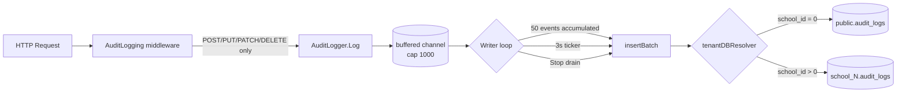
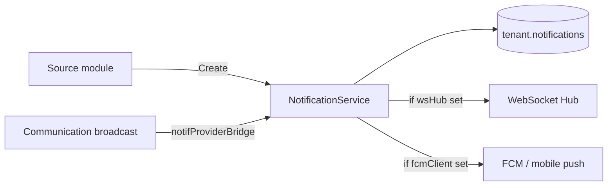
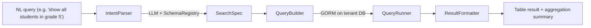
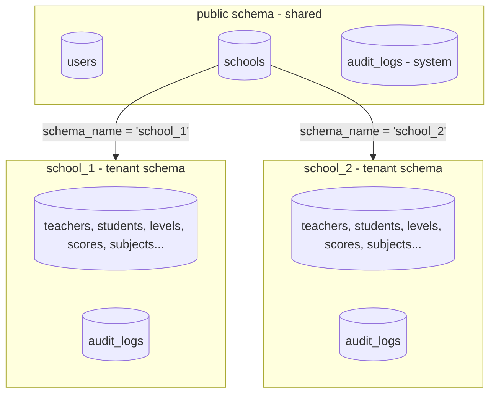
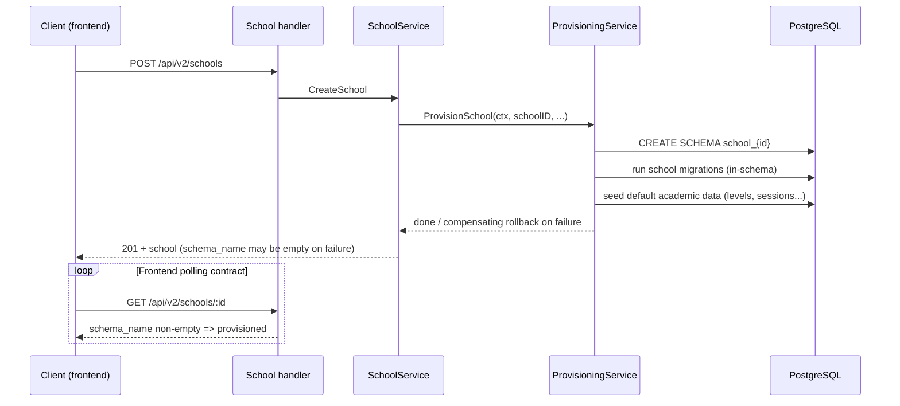
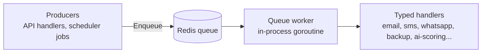
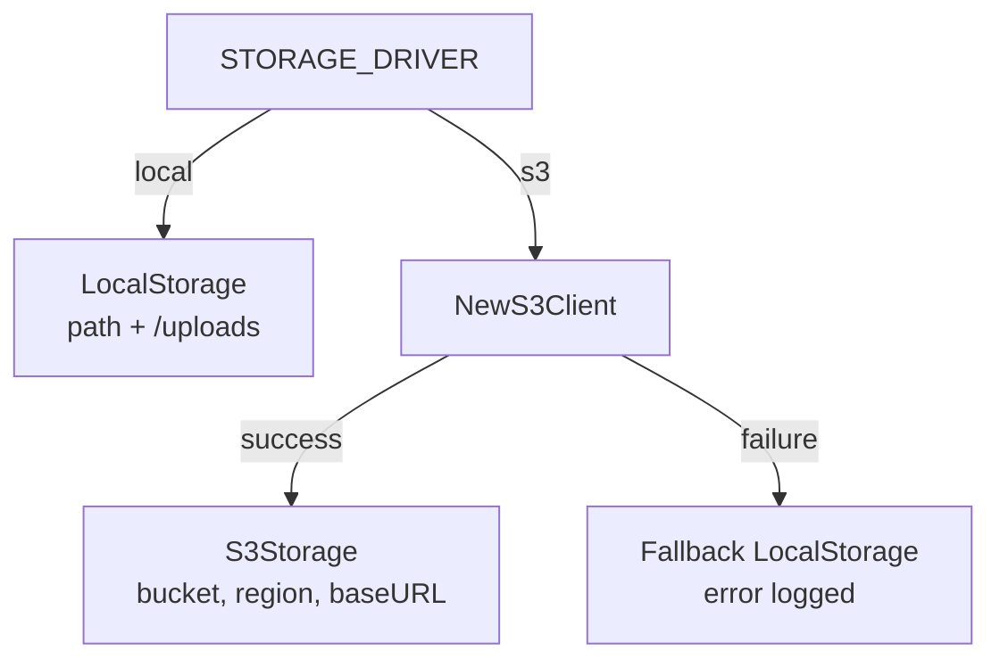

# FSD Part 05 — Platform Services

**Document ID**: FSD-05-PLATFORM
**Applies to**: Academio — School Management and Education ERP
**Status**: Implemented / Partial / Planned (see legend)
**Audience**: Backend engineers, platform engineers, DevOps, QA
**Cross-references**: FSD Part 01 (Product), FSD Part 02 (Requirements), FSD Part 03 (UX Design), FSD Part 04 (Data & API Design), FSD Part 06 (Engineering — Security, Monitoring, Performance, Disaster Recovery, Testing, Deployment, CI/CD, Scalability).

---

## 0. Implementation Status Legend

Every capability in this document is labeled with one of three statuses, verified against the current codebase.

| Status | Meaning |
|---|---|
| **Implemented** | Feature is present in the codebase, wired at startup, and exercised by existing routes/tests. |
| **Partial** | Core flows exist, but optional integrations are disabled unless configured, or specific sub-capabilities are placeholders. |
| **Planned** | Intended design documented here; not yet implemented (or implemented behind optional configuration only). |

**Module map.** All platform services live under `backend/internal/` and are composed in `backend/internal/router/setup.go`. This FSD suite standardizes on "Academio"; legacy code identifiers are being normalized in parallel engineering work (see Part 1, brand transition note). Code paths are referenced here without module prefixes for brevity.

| Package | Responsibility |
|---|---|
| `middleware/audit.go` | Audit event model, async audit logger, HTTP mutation middleware |
| `modules/audit/` | Audit log query API (list, get, archive) |
| `modules/notifications/` | In-app notification persistence and delivery (WebSocket/FCM optional) |
| `modules/communication/` | Email/SMS/WhatsApp campaigns, templates, broadcasts (queue-backed) |
| `internal/queue/` | Asynq task definitions, client, worker, handler registration |
| `internal/scheduler/` | robfig/cron scheduler and periodic jobs |
| `internal/database/tenant/` | Schema-per-tenant infrastructure: provisioning, resolution, schema DB |
| `modules/tenant/` | Tenant configuration and feature-flag API |
| `pkg/storage/` | Storage driver abstraction: local filesystem and S3-compatible object storage |
| `internal/ai/search/` | Natural-language search engine (parse -> build -> execute -> format) |

---

## 1. Audit Logging

**Status: Implemented**

Academio records a full audit trail of who changed what, when, and from where. Audit logging is a cross-cutting concern applied through a shared middleware and service-layer helper, so every module inherits it without module-specific code.

### 1.1 Event Model

The core event type is `AuditEvent`, defined in `middleware/audit.go`. It is the canonical shape for both HTTP-level and service-level audit entries.

| Field | Type | Purpose |
|---|---|---|
| `SchoolID` | uint | Owning tenant; `0` for system-level (super-admin) events |
| `UserID` | uint | Actor |
| `Action` | string | `create`, `update`, `delete`, `access`, or module-defined action |
| `ResourceType` | string | Inferred from route (e.g. `users`, `student`), or explicit in service calls |
| `ResourceID` | string | Affected record ID (service-layer only) |
| `ImpSchoolID` | uint | Tenant under impersonation (super-admin audits), `0` otherwise |
| `OldValues` | `*models.JSONMap` | Before-image for mutation details |
| `NewValues` | `*models.JSONMap` | After-image for mutation details |
| `IPAddress` | string | Client IP |
| `UserAgent` | string | Client user agent |
| `RequestID` | string | Correlation ID propagated through the request (see FSD Part 06, Monitoring) |

### 1.2 Storage Topology — Two Locations, One Model

Audit rows are stored in two places depending on scope, both using the same `models.AuditLog` definition:

1. **System-level events** (`school_id = 0`) — super-admin impersonation, tenant provisioning, global configuration changes — are written to the `audit_logs` table in the **public (shared) schema**.
2. **Per-school events** (`school_id > 0`) — every authenticated mutation inside a tenant — are written to the tenant's `audit_logs` table in **`school_{id}`** schema.

The `tenantDBResolver` callback passed to `NewAuditLogger` returns the correct `*gorm.DB` for a school ID: the core DB for `schoolID == 0`, or a schema-scoped DB (via `tenant.NewSchemaDB`) for provisioned tenants. If resolution fails or the school is not provisioned, events for that tenant are dropped with a warning rather than crashing the flush.

Migrations (core schema):

| Migration ID | Change |
|---|---|
| `2024_01_01_000010_create_audit_logs_table` | Creates `audit_logs` (AutoMigrate on `models.AuditLog`) |
| `2026_07_22_000001_add_imp_school_id_to_audit_logs` | Adds `imp_school_id BIGINT NOT NULL DEFAULT 0` + `idx_audit_imp_school_id` |

The tenant-schema migration set (see `migrations/school/`) creates the per-tenant `audit_logs` table during provisioning.

### 1.3 Asynchronous Write Path

The `AuditLogger` decouples request handling from database writes to keep latency flat.



Key parameters:

| Parameter | Value |
|---|---|
| Channel capacity | 1000 events |
| Batch flush threshold | 50 events |
| Flush interval | 3 seconds |
| Write timeout per batch | 10 seconds |
| Enqueue behaviour when full | Non-blocking drop (request never blocks) |

`Start()` launches the background writer goroutine; `Stop()` gracefully drains remaining events before shutdown (invoked from the server shutdown hook in `router/setup.go`).

### 1.4 Capture Points

**HTTP middleware.** `AuditLogging(auditLogger)` is applied after `JWTAuth` on every authenticated route group via the shared `authGroup()` helper, and also on the `schools` admin group. It:

- Stores `ClientIP` and `UserAgent` on the request context for downstream service-layer use.
- Logs only mutating methods: `POST`, `PUT`, `PATCH`, `DELETE`.
- Derives `Action` from the method: `POST` -> `create`, `PUT`/`PATCH` -> `update`, `DELETE` -> `delete`.
- Derives `ResourceType` from the route path (last non-parameter segment), with an override map for ambiguous patterns (e.g. `/api/v2/user/student/:id` -> `student`).

**Service-layer helper.** `LogMutation(...)` records fine-grained entries with `ResourceID`, `OldValues`, and `NewValues` — used throughout domain modules (media uploads, finance, HR, etc.) for before/after trails that the middleware cannot infer.

### 1.5 Query API

`modules/audit` exposes the audit trail to authorized clients. Routes are registered under `/api/v2/audit-logs` with tenant resolution applied:

| Endpoint | Purpose |
|---|---|
| `GET /api/v2/audit-logs` | Paginated, filterable list (`AuditFilter`: `Action`, `ResourceType`, `UserID`, `Search`, `Page`, `Limit`) |
| `GET /api/v2/audit-logs/:id` | Single audit entry |
| `GET /api/v2/audit-logs/archive` | Paginated archived entries |
| `GET /api/v2/audit-logs/archive/:id` | Single archived entry |

Archived entries use the `AuditLogArchive` model. Per-tenant queries resolve to the tenant schema DB; system-level queries use the core DB.

### 1.6 Retention and Archival

The scheduler runs an **audit archive job** daily at 01:00 UTC (`AuditArchiveCron`, default `0 1 * * *`):

- For every school with a non-empty `schema_name`, opens the schema-scoped DB.
- Selects `audit_logs` rows older than **90 days** in batches of 1000.
- Inserts them into the archive table, then deletes from the live table.
- Continues batch-by-batch until the school's old logs are exhausted; per-school failures are logged and do not stop other schools.

This keeps live tables small while preserving a complete, queryable history. See FSD Part 06 (Engineering) for retention policy and evidence requirements.

---

## 2. Notifications

**Status: Partial** — in-app notifications are fully implemented; WebSocket real-time push and FCM mobile push are wired but **disabled unless configured**.

### 2.1 Overview

The notifications module (`modules/notifications`) provides:

- Persisted, per-user, per-tenant notification records.
- Unread tracking and read-state management.
- Optional real-time delivery over WebSocket when the hub is enabled.
- Optional push delivery via Firebase Cloud Messaging (FCM) when credentials are configured.



### 2.2 Service

`NotificationService` holds a repository, an optional `*ws.Hub`, and an optional `*fcm.Client` (both nil by default). `Create(ctx, userID, schoolID, title, message, notifType)` persists the record and, when a hub is attached, broadcasts to the recipient's connected sessions. `SetHub` and `SetFCMClient` are optional setters invoked at startup only when the corresponding infrastructure is enabled.

Startup wiring (`router/setup.go`):

| Dependency | Enabling condition | Behaviour when missing |
|---|---|---|
| WebSocket hub | `WS_ENABLED=true` (`config.WebSocket.Enabled`) | Real-time push skipped; records still persisted and pollable |
| FCM client | `FCM_CREDENTIALS_PATH` set and valid | Push disabled with a warning |

### 2.3 API

Routes under `/api/v2/notifications` (tenant-aware, authenticated):

| Endpoint | Purpose |
|---|---|
| `GET /notifications` | Paginated notification list for the caller |
| `GET /notifications/unread-count` | Unread counter badge |
| `PUT /notifications/:id/read` | Mark one as read |
| `PUT /notifications/read-all` | Mark all as read |
| `DELETE /notifications/:id` | Delete a notification |
| `POST /notifications/device-tokens` | Register an FCM device token |
| `POST /notifications/device-tokens/remove` | Unregister a device token |
| `DELETE /notifications/device-tokens` | Unregister (alias) |

### 2.4 Broadcast Integration

The communication module's `SendBroadcast` is the primary producer of bulk notifications. It resolves target user IDs by filter (all / role / class / specific users), creates a tracking campaign, and for each recipient calls the notification provider. The adapter `notifProviderBridge` bridges `CommunicationService` (which expects a `NotificationProvider` interface) to `NotificationService.Create`, decoupling the two modules. Per-recipient notification failures are logged and skipped — a single bad recipient never fails a broadcast.

Optionally, a broadcast may also fan out through a channel (`email`, `sms`, `whatsapp`); those deliveries are enqueued as background tasks (see Section 7).

### 2.5 Gaps and Roadmap

- **Planned**: per-channel delivery preferences (in-app / email / SMS / push toggles per user).
- **Planned**: notification templates with variable interpolation (currently broadcasts send raw title/message).
- **Planned**: push notification payload localization for the student/parent mobile apps (see `docs/architecture/5-AI-ARCHITECTURE.md` for the mobile/AI integration roadmap).

---

## 3. Search

**Status: Partial** — SQL fuzzy search across modules and an AI natural-language search engine are implemented; vector-based semantic search runs on PostgreSQL pgvector (Qdrant retired in PGV-06).

### 3.1 Overview

Academio supports three search tiers:

| Tier | Mechanism | Status |
|---|---|---|
| 1. Record search | PostgreSQL `ILIKE` filters in module repositories | Implemented |
| 2. Fuzzy index | `pg_trgm` extension + GIN trigram indexes | Implemented |
| 3. Natural language | AI NL search engine (`/api/v2/ai/search`) | Implemented (requires `AI_ENABLED`) |
| 4. Semantic/vector | pgvector store + RAG pipeline | Implemented (PGV-06; requires `AI_PGVECTOR_DSN` + `AI_ENABLED`) |

### 3.2 Record Search with ILIKE

Domain repositories apply `ILIKE` filters for partial-match, case-insensitive lookups. Verified usages include alumni, audit logs, transport, finance, HR, and forum modules — e.g. searching students by name, staff by name, or forum posts by content. Results remain paginated per the platform-wide pagination contract (FSD Part 04, API Design).

### 3.3 Trigram Indexing (pg_trgm)

Two core migrations enable fast fuzzy search on the shared `users` table:

| Migration ID | Change |
|---|---|
| `2026_07_16_000901_enable_pg_trgm` | `CREATE EXTENSION IF NOT EXISTS pg_trgm`; GIN index `idx_users_username_trgm ON users USING gin (username gin_trgm_ops)` |
| `2026_07_16_000902_index_users_email_trgm` | GIN index `idx_users_email_trgm ON users USING gin (email gin_trgm_ops)` |

Rollbacks drop the indexes and the extension. These indexes accelerate `%query%` ILIKE lookups on username and email — the most common identity searches across the platform.

### 3.4 AI Natural-Language Search

The `internal/ai/search` package turns plain-language questions into structured queries against real tenant data.



| Stage | Component | Responsibility |
|---|---|---|
| Parse | `IntentParser` | Uses the AI provider to map NL to a structured `SearchSpec` (target entity, filters, ordering); unknown intent yields a friendly clarification response |
| Build | `QueryBuilder` | Translates the spec into a GORM query against the schema-scoped tenant DB (never raw SQL concatenation) |
| Execute | `Engine.Search` | Runs against the current tenant's DB |
| Format | `ResultFormatter` | Returns columns, rows, total count, and optional aggregations |
| Tool | `SearchAsTool` | Renders results as a text table for AI agent tool responses |

Attach condition: the engine is created and attached to the AI handler only when `db != nil` (registered in `router/setup.go`). Route: `POST /api/v2/ai/search`.

The search schema registry (`SchemaRegistry`) enumerates queryable entities and their fields, keeping the NL layer decoupled from raw SQL.

### 3.5 Planned: Semantic / Vector Search

- **Implemented (PGV-06)**: pgvector-backed vector store (`internal/ai/vector`, `PGVectorStore`) with fixed-size chunking (`rag.Chunker`, `StrategyFixedSize`) and embeddings from the configured AI provider. Qdrant was the pre-pgvector implementation (retained as behavioral reference per D-05; final removal in Phase 7 RET-02).
- **Planned**: RAG pipeline over curriculum, policies, and knowledge-base documents to power retrieval-augmented answers for the academic tutor and teacher assistant agents.
- Config uses `AI_PGVECTOR_DSN` (required, validated at startup) plus `AI_EMBEDDING_DIM`; the pipeline initializes only when the DSN is set and AI is enabled.
- **Planned**: hybrid ranking (SQL filters + vector similarity) and index re-build jobs.

See `docs/architecture/5-AI-ARCHITECTURE.md` for the full AI and RAG architecture.

---

## 4. Global Settings

**Status: Partial** — tenant configuration, feature flags, and plan limits are implemented; a dedicated cross-tenant "global settings" console is planned.

### 4.1 What Is Covered

Global settings are modelled at three levels:

| Level | Mechanism | Status |
|---|---|---|
| Platform defaults | `PlanDefaultsConfig` (env-driven) for `free`, `basic`, `premium`, `enterprise` | Implemented |
| Tenant overrides | `tenant_configs` table, overridable per school | Implemented |
| Runtime cache | `TenantResolver` middleware loads config Redis -> DB and attaches it to the request context | Implemented |

### 4.2 Plan Defaults

Plan defaults define resource limits and feature flags per tier. They are compiled into `Config.Plan` at startup from environment variables and serve as the base before per-tenant overrides.

| Plan | Rate limit (req/min) | Has AI | Has WebSocket | Student limit | Storage (MB) |
|---|---|---|---|---|---|
| Free | 60 | No | No | 100 | 100 |
| Basic | 120 | No | No | 500 | 500 |
| Premium | 300 | Yes | Yes | 2000 | 2048 |
| Enterprise | 1000 | Yes | Yes | Unlimited | 10240 |

These same limits feed the distributed rate limiter (`RateLimitConfig.Tiers`) and the tenant resolution service.

### 4.3 Tenant Configuration API

`modules/tenant` exposes the configuration surface. Routes are registered under `/api/v2/tenants`:

| Endpoint | Purpose | Access |
|---|---|---|
| `GET /api/v2/tenants/config` | Full tenant config: plan, rate limit, student max, storage max, AI/WS flags | Any authenticated tenant user |
| `PUT /api/v2/tenants/config` | Update plan/features/overrides | `super-admin` or `admin` only |
| `GET /api/v2/tenants/features` | Feature-flag state for the current tenant | Any authenticated tenant user |

`TenantService` provides `GetTenantConfig`, `UpdateConfig`, `GetFeatureFlag`, `GetRateLimitTier` (falls back to the plan default), `GetRateLimitPerMin`, and `CheckFeatureAccess`. Responses carry `SchoolID`, `Plan`, `RateLimit`, `StudentMax`, `StorageMax`, `HasAI`, `HasWS`.

### 4.4 School-Level Profile

School profile settings (name, logo, code, framework, type, `schema_name`) live on the `schools` table in the shared schema and are managed through the schools module — see FSD Part 02 (Requirements, Module Inventory). Academic term configuration is handled by the academic-calendar module (term dates, terminology per school type).

### 4.5 Planned: Global Settings Console

- **Planned**: super-admin console for cross-tenant defaults: onboarding email templates, default locale/currency (NGN by default per platform policy), regional settings.
- **Planned**: audit trail for every settings change (system-level audit events already supported by Section 1).
- **Planned**: configuration versioning and rollback for plan changes.

---

## 5. Tenant Architecture

**Status: Implemented** (core platform mechanism)

Academio is a multi-tenant platform using **schema-per-tenant isolation**: a single shared PostgreSQL instance/database, with each tenant's data isolated in its own PostgreSQL schema named `school_{id}`. Shared identity data (users) lives in the `public` schema.

### 5.1 Architectural Model



Rationale: schema-per-tenant (vs. dedicated databases or shared tables with `tenant_id`) gives strong isolation and simple tenant-scoped querying with a single connection pool, at the cost of per-tenant schema provisioning — which is exactly what `ProvisioningService` automates.

### 5.2 Schema DB and Table Prefixing

`tenant.SchemaDB` wraps the shared `*gorm.DB` with a schema name. It uses the `SchemaTablePrefix` GORM plugin via session context to prefix all table names with `school_{id}.` during operations, avoiding the connection-pool pitfalls of `SET search_path` (a pooled connection may not return to the expected schema). Each call gets a fresh session, so no session state leaks between requests.

- `middleware.SetTenantDBFactory(repoFactory)` registers the tenant repository factory globally.
- Handlers obtain per-request tenant repositories via `middleware.GetTenantRepos(c)` and use `repos.TenantDB()` for school-scoped data or `repos.CoreDB()` for shared data.
- The `AuthGroup` helper composes the chain: `JWTAuth` -> `EnforceSchoolID` -> `TenantResolution` -> route handlers.

### 5.3 Provisioning

Provisioning is **synchronous** and idempotent (`tenant.ProvisioningService.ProvisionSchool`):



Provisioning steps:

1. **Schema creation** — `CREATE SCHEMA` for the tenant, with a safe identifier validated against `^[a-z][a-z0-9_]*$`.
2. **Migrations** — run the tenant migration set inside the new schema (schema migrations use `SET LOCAL search_path` within a transaction).
3. **Seed data** — create default academic data (levels, sessions, and other baseline records) so the school is immediately usable.
4. **Failure handling** — compensating actions roll back partially completed work, including `DROP SCHEMA ... CASCADE`, so a failed provisioning never leaves a half-created tenant. The flow is panic-safe: a panic triggers the same cleanup.

The provisioning signal is `models.SchoolConnection.SchemaName`: **a non-empty `schema_name` means the tenant is provisioned and active**. The school handler reads `schema_name` with a `*string` to distinguish NULL (not provisioned) from an empty string.

**Frontend polling contract**: because provisioning is synchronous but can take time, the frontend must poll `GET /api/v2/schools/:id` until `schema_name` is non-empty before enabling the tenant workspace.

**Reprovisioning / recovery**: `POST /api/v2/schools/:id/re-provision` re-runs the full pipeline for schools stuck in a failed status via `RecoveryService.ReprovisionSchool`; `RetrySchemaMigrations` re-runs pending schema migrations for an existing tenant.

### 5.4 Tenant Resolution and Caching

`TenantResolutionService.ResolveTenant` maps a `school_id` to a `TenantContext` and caches the result in Redis.

| Detail | Value |
|---|---|
| Cache key (by ID) | `tenant:ctx:{school_id}` |
| Cache key (by UUID) | `tenant:ctx:uuid:{uuid}` |
| TTL | 5 minutes |
| Redis optional? | Yes — `rdb == nil` disables caching (still resolves from DB) |
| Error cases | `TENANT_NOT_PROVISIONED`, `TENANT_DISABLED` |

`TenantContext` carries `SchoolID`, `SchoolUUID`, `SchoolName`, `Plan`, `SchemaName`, `Status`, and `ResolvedAt`. Resolution errors distinguish not-provisioned from disabled tenants so handlers can return accurate errors.

The **cache-warm cron job** refreshes the resolution cache for all active schools every 30 minutes, so cold caches are pre-populated before traffic arrives (see Section 7).

### 5.5 Isolation and Testing

Tenant isolation is covered by dedicated tests in `internal/database/tenant/` (`isolation_test.go`, `integration_test.go`, `provisioning_rollback_test.go`) using testcontainers-based PostgreSQL. The rollback test verifies that a failed provisioning leaves no residual schema or partial data.

### 5.6 Scaling Considerations

- All tenant queries stay on a single shared connection pool; no per-tenant connections are opened.
- Schema count scales linearly with schools; the platform is designed for thousands of schemas with bounded migration/backup fan-out (each fan-out job iterates schools with a non-empty `schema_name`).
- **Planned**: automatic schema-level partitioning or archive schemas for very large tenants; connection read/write splitting (see FSD Part 06, Scalability Plan).

---

## 6. Event-driven Architecture

**Status: Partial** — task-driven asynchronous processing and real-time push exist; a formal domain event bus is planned.

### 6.1 Current Model: Task-Driven Asynchrony

Academio's async backbone is a Redis-backed task queue (Asynq) rather than a pub/sub event bus. Producers enqueue typed tasks; the in-process worker executes handlers with retries.



This model gives:
- Reliable, retried execution for external side effects (email/SMS/WhatsApp delivery, backups).
- Backpressure isolation — slow provider calls never block HTTP handlers.
- Resumable batch work (backups, AI scoring) via task payloads.

### 6.2 Inter-Module Integration Points

| Producer | Consumer | Mechanism |
|---|---|---|
| Communication module | Notifications module | `NotificationProvider` interface + `notifProviderBridge` adapter (in-process, no queue) |
| Notifications service | WebSocket hub / FCM | Optional in-process hub + push client |
| Domain modules (school, academic) | Queue | Enqueue `email:send` for transactional email |
| Scheduler jobs | Queue | Enqueue batch tasks (backup, report, billing) |

### 6.3 Planned: Domain Event Bus

- **Planned**: a lightweight domain event bus with publish/subscribe semantics and an outbox pattern for transactional consistency (e.g. `SchoolProvisioned`, `StudentEnrolled`, `PaymentReceived`).
- **Planned**: event handlers as composable consumers (notify, audit, analytics, AI retraining triggers).
- **Planned**: cross-service fan-out when the platform is split into multiple deployable services (see FSD Part 06, Deployment Strategy).
- **Planned**: dead-letter inspection and replay tooling via the existing Asynq inspector.

---

## 7. Background Jobs

**Status: Implemented**

### 7.1 Queue Infrastructure (Asynq)

`internal/queue` wraps Asynq (`github.com/hibiken/asynq`):

| Component | Role |
|---|---|
| `QueueClient` | Enqueues tasks with per-task options (`asynq.MaxRetry(3)` etc.); wraps `asynq.Client` |
| `QueueWorker` | `asynq.Server` + `ServeMux`; runs as a goroutine inside the same process as the API |
| `QueueInspector` | `asynq.NewInspector` — used by the health check and for queue observability |
| `TaskHandlers` | Dependency container binding task types to handler functions (nil-safe) |

Queue configuration:

| Setting | Default |
|---|---|
| `QUEUE_REDIS_ADDR` | `localhost:6379` |
| `QUEUE_REDIS_DB` | `1` (separate from cache DB 0) |
| `QUEUE_CONCURRENCY` | 10 |
| `QUEUE_MAX_RETRIES` | 5 |
| `QUEUE_RETRY_DELAY_BASE` | 30s (exponential: base * 2^n) |

Queues and priorities: `default` weight 3, `provisioning` weight 1. The worker starts only when Redis is configured; otherwise it logs a warning and stays off. Graceful `Shutdown()` drains in-flight tasks on server stop.

### 7.2 Task Types

| Task type | Payload | Handler | Producer |
|---|---|---|---|
| `email:send` | MessageID, SchoolID, To, Subject, Body, Provider, TemplateID, Data | Email task handler (Mailjet/SendGrid via provider factory) | Communication service, school/academic email queue |
| `sms:send` | MessageID, SchoolID, To, Message, Provider | SMS task handler (Twilio) | Communication service |
| `whatsapp:send` | MessageID, SchoolID, To, Message, Provider | WhatsApp task handler (Twilio) | Communication service |
| `report:generate` | SchoolID, StudentID, Session, Term, ClassName, ReportType, Format | Placeholder (logs; report cards generate synchronously today) | Scheduled weekly job (pending) |
| `ai:scoring` | ApplicationID, SchoolID | AI admission scoring (temperature 0.3, writes score/eligibility/reasoning back) | Admissions module |
| `backup:create` | SchoolID | Backup task handler (S3 backup storage) | Nightly scheduler job |
| `restore:execute` | SchoolID, BackupID | Restore task handler | Backup/restore API |
| `provisioning:school` | SchoolID, AdminUserID, Firstname, Lastname, Passport | Provisioning task handler (calls ProvisioningService + RecoveryService) | Registered for backward compatibility; current creation flow provisions synchronously (Section 5.3) |

`RegisterTaskHandlers` binds only the handlers that were wired; unbound task types are safe no-ops at the mux level.

### 7.3 Cron Scheduler

`internal/scheduler` uses `robfig/cron/v3` with `SkipIfStillRunning` and `Recover` chains, timezone-locatable (UTC default).

| Job | Schedule (default) | Purpose | Status |
|---|---|---|---|
| Nightly backup | `0 2 * * *` (02:00 daily) | Enqueue `backup:create` for every school with a non-empty `schema_name` | Implemented |
| Weekly report | `0 3 * * 1` (Monday 03:00) | Enqueue `report:generate` batch | Placeholder (report-card batch logic pending) |
| Monthly billing | `0 4 1 * *` (1st 04:00) | Enqueue billing/invoice generation | Placeholder (billing module pending) |
| Cache warm | `*/30 * * * *` (every 30 min) | Refresh tenant resolution cache for all active schools | Implemented |
| Audit archive | `0 1 * * *` (01:00 daily) | Move audit logs older than 90 days to archive (Section 1.6) | Implemented |

Schedule overrides: `CRON_BACKUP`, `CRON_REPORT`, `CRON_BILLING`, `CRON_CACHE_WARM` environment variables. The runner starts with the server and stops during graceful shutdown.

### 7.4 Health and Observability

The health endpoint wires the queue inspector for queue status checks (`health.SetQueueInspector`). Logs use `pkg/logger` (slog wrapper) throughout — no `fmt.Printf`/`log.Print` in application code (Rule B3).

---

## 8. Caching Strategy

**Status: Partial** — Redis-backed caches for tenant resolution, tokens, and rate limiting are implemented; a general query cache is planned.

### 8.1 Implemented Caches

| Cache | Backing | Key / TTL | Invalidation |
|---|---|---|---|
| Tenant context | Redis | `tenant:ctx:{id}`, `tenant:ctx:uuid:{uuid}` — 5 min TTL | TTL expiry; cache-warm job refreshes; resolution writes refresh |
| Refresh tokens | Redis | Via `RefreshTokenCache` (same window as token lifetime) | Token rotation / logout |
| Rate limit counters | Redis | Per plan + per IP tiers (`RateLimitConfig`) | Sliding window counters |
| Tenant config (middleware) | Redis -> DB | Loaded per request by `TenantResolver`, read-through | TTL / plan updates |
| Asynq task queues | Redis DB 1 | Task lists, retry state | Worker consumption; inspector |

`middleware.TenantResolver` loads tenant config from Redis first, falling back to the DB, and attaches `TenantConfig`, `Plan`, `Features`, and `Limits` to the request context.

### 8.2 Cache Warm

The cache-warm job (every 30 minutes) iterates all active schools (`schema_name` non-empty) and calls `TenantResolutionService.WarmCacheByUUID` to pre-populate the resolution cache, reducing first-request latency after deployments or cache evictions.

### 8.3 Planned: Query Cache

- **Planned**: cache-aside for hot read paths (dashboard aggregates, class lists, attendance summaries) with a unified `CacheService` facade.
- **Planned**: event-driven invalidation (see Section 6.3) so writes evict exactly the affected keys — no stale dashboards.
- **Planned**: ETag / 304 support on read-heavy list endpoints to cut bandwidth.
- **Planned**: per-tenant cache namespacing to preserve isolation guarantees.

---

## 9. File Storage

**Status: Implemented**

### 9.1 Storage Abstraction

`pkg/storage` defines the `Driver` interface:

```go
type Driver interface {
    Save(ctx context.Context, filename string, reader io.Reader) (path string, err error)
    Delete(ctx context.Context, path string) error
    URL(path string) string
    WithPrefix(prefix string) Driver
    ListObjects(ctx context.Context, prefix string) ([]ObjectInfo, error)
}
```

| Driver | Backend | Notes |
|---|---|---|
| `LocalStorage` | Local filesystem | Serves files via `r.Static("/uploads", cfg.Storage.Path)`; `WithPrefix` is a no-op |
| `S3Storage` | AWS S3 / S3-compatible (MinIO, DO Spaces) | Path-style endpoint support for MinIO; per-school prefixes via `WithPrefix`; public URL from `S3_BASE_URL` or derived from bucket+region |

Object key format: `{safe_name}_{unix_nano}{ext}` — timestamp guarantees uniqueness; the school prefix provides isolation (no date directories needed).

### 9.2 Startup Selection



- Config: `STORAGE_DRIVER=local|s3`, `STORAGE_PATH` (default `./uploads`), `S3_REGION`, `S3_BUCKET`, `S3_ACCESS_KEY`, `S3_SECRET_KEY`, `S3_ENDPOINT`, `S3_BASE_URL`.
- Production validation (Rule B12): S3 driver requires access key, secret key, and bucket at startup; missing credentials fail fast.
- If S3 client creation fails at runtime, the server falls back to local storage and logs the error — uploads never silently break.

### 9.3 Per-Tenant Prefixes

`schools.s3_path` (added by migration `2026_07_08_000002_add_s3_path_to_schools`) stores the school's object-store prefix. The media service composes `mediaPrefix = school.S3Path + "/media"` and calls `store.WithPrefix(mediaPrefix)`, so each school's files are isolated under its own prefix in shared buckets.

### 9.4 Media Library

The media module (`modules/media`) provides the rich media library API under `/api/v2/schools/:id/media/library`:

| Endpoint | Purpose |
|---|---|
| `GET /media/library` | Paginated media list |
| `POST /media/library` | Upload (multipart) |
| `GET /media/library/:id` | Media detail |
| `PATCH /media/library/:id` | Rename |
| `DELETE /media/library/:id` | Delete record + best-effort storage delete |
| `GET /media/library/stats` | Media statistics |
| `GET /media/library/s3` | List all files in the school's S3 prefix |

Upload constraints:

| Constraint | Value |
|---|---|
| Max file size | 50 MB (`MaxFileSize = 50 << 20`) |
| Allowed extensions | jpg, jpeg, png, gif, webp, svg, pdf, mp4, webm, mov, mp3, wav, doc, docx, xls, xlsx |
| Validation | Extension whitelist + size check before storage; MIME mapping; image dimension detection for image metadata |
| Cleanup | If the DB record insert fails, the uploaded object is best-effort deleted from storage |
| Audit | Upload/delete/rename are audited with `LogMutation` |

The legacy `/media` endpoint (multimedia module) remains for backward compatibility.

### 9.5 Backup Storage

Backup/restore uses `S3BackupStorage` when S3 credentials are configured (`S3_ACCESS_KEY` + `S3_BUCKET`). The `tenant_backups` table records backup metadata (school, name, path, size, status, restore point). Restore endpoints are registered under `/api/v1/backups/:schoolId` (`list`, `restore`, `status`) with Redis-backed rate limiting when available. If S3 is not configured, backup services are disabled with a logged warning — the nightly backup job simply has no handler bound.

### 9.6 Roadmap

- **Planned**: presigned URLs for direct-to-S3 uploads from the frontend (large media).
- **Planned**: storage quota enforcement per plan (`StorageMB` from Section 4).
- **Planned**: CDN integration via `S3_BASE_URL` for media serving at scale.
- **Planned**: BitReactor SDK storage adapter when available (noted in the driver interface).

---

## Appendix A. Platform Configuration Reference

| Env var | Default | Purpose |
|---|---|---|
| `STORAGE_DRIVER` | `local` | `local` or `s3` |
| `STORAGE_PATH` | `./uploads` | Local storage root |
| `S3_REGION`, `S3_BUCKET`, `S3_ACCESS_KEY`, `S3_SECRET_KEY`, `S3_ENDPOINT`, `S3_BASE_URL` | — | S3/MinIO storage |
| `QUEUE_REDIS_ADDR`, `QUEUE_REDIS_DB`, `QUEUE_CONCURRENCY`, `QUEUE_MAX_RETRIES`, `QUEUE_RETRY_DELAY_BASE` | `localhost:6379`, `1`, `10`, `5`, `30s` | Asynq queue |
| `CRON_BACKUP`, `CRON_REPORT`, `CRON_BILLING`, `CRON_CACHE_WARM` | `0 2 * * *`, `0 3 * * 1`, `0 4 1 * *`, `*/30 * * * *` | Cron schedules |
| `WS_ENABLED`, `WS_MAX_CONN_PER_USER`, `WS_MSG_RATE_LIMIT`, `WS_WRITE_TIMEOUT`, `WS_READ_TIMEOUT`, `WS_PING_INTERVAL` | off, 5, 30, 10s, 60s, 30s | WebSocket hub |
| `FCM_ENABLED`, `FCM_CREDENTIALS_PATH` | off, — | Push notifications |
| `AI_ENABLED`, `AI_PROVIDER`, `AI_PGVECTOR_DSN`, `AI_EMBEDDING_DIM` | off, gemini, —, 1536 | AI search / RAG |
| `COMMUNICATION_EMAIL_PROVIDER`, `SENDGRID_API_KEY`, `MAILJET_API_KEY`, `MAILJET_SECRET_KEY` | mailjet, — | Email provider |
| `COMMUNICATION_SMS_PROVIDER`, `TWILIO_ACCOUNT_SID`, `TWILIO_AUTH_TOKEN`, `TWILIO_FROM_NUMBER` | twilio, — | SMS provider |
| `PLAN_*_RATE_LIMIT`, `PLAN_*_STUDENT_LIMIT`, `PLAN_*_STORAGE_MB` | per plan | Plan defaults |

All configuration is validated at startup (Rule B12): invalid or missing required settings fail fast and prevent the server from starting.

---

## Appendix B. Implementation Status Summary

| Section | Status |
|---|---|
| 1. Audit Logging | Implemented |
| 2. Notifications | Partial (in-app done; WS/FCM optional) |
| 3. Search | Partial (SQL + NL done; vector planned) |
| 4. Global Settings | Partial (tenant config done; global console planned) |
| 5. Tenant Architecture | Implemented |
| 6. Event-driven Architecture | Partial (task queue + WS; event bus planned) |
| 7. Background Jobs | Implemented |
| 8. Caching Strategy | Partial (Redis core done; query cache planned) |
| 9. File Storage | Implemented |

**Implemented: 4** | **Partial: 5** | **Planned sub-capabilities are documented inline within each section.**
